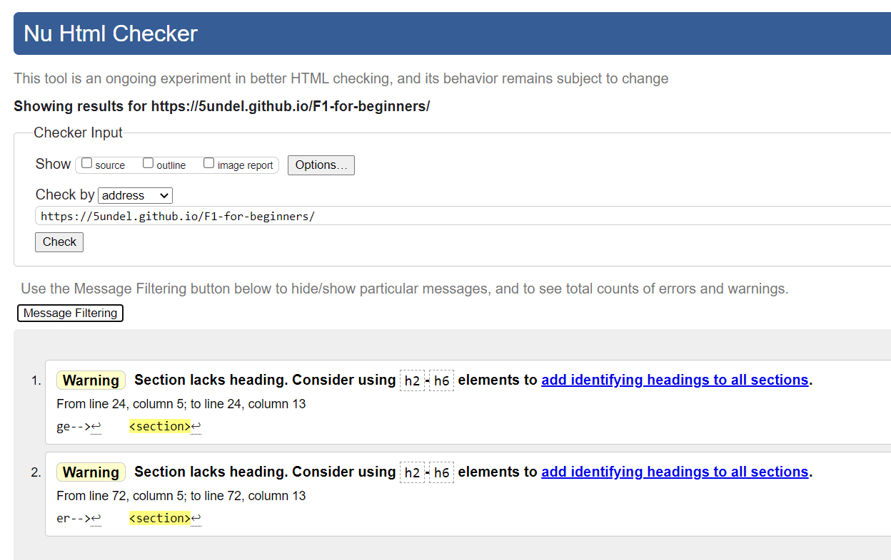
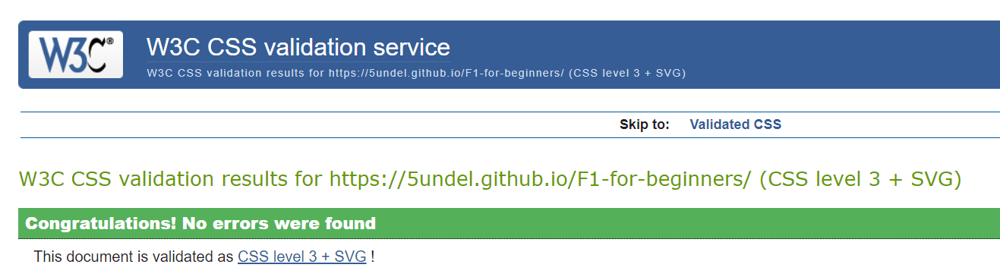

[Formula One pad.pdf](https://github.com/5undel/F1-for-beginners/files/7070803/Formula.One.pad.pdf)
# F1
F1 page is a site that will help people understand Formula 1 better. The site will be targeted toward those how are new to the sport and are looking for an easy explanation about Formula 1.
## User Experience (UX)
### As a first-time visitor Goal
- As a first-time user on the page, I want to be able to easily navigate through the site.
- I want to easily understand the content on the site.
 
### Existing Features
- __Navigation Bar__
  - Featured on all pages, full responsive navbar links to the home page, team page, and race page. The navbar is the same look on all pages to make it easy to navigate.
  - The navbar makes it easy for the user to navigate from page to page on all platforms.
  

- __What is Formula One__ 

  - The Formula One section will allow users to read what Formula One is and get an understanding.
   

- __Fast link__
  - With this section, the user can get an insight into what team and race is all about
  - The user gets an easier way to navigate
  

- __Team__

  - The team section will allow the users to get a better understanding of the team and see the list of all the teams in the 2021 season.
  

- __Race__
  - In the race section can the user read about the whole race weekend and get an understanding of how the weekend is planned.
  - The user can easily read about the different parts of the weekend
  

- __Footer__
  - User can visit us on ouer other pages like facebook and instagram
  - User can contact us on email link
  

### DESIGN
- Appearance
  - The site has a clean look with a white background color.
- Print
  - The font-text is Times New Roman for a clean look and easy to read.
- Image
  - One big hero image on all pages which catches the visitors' eyes.

### TEST
- HTML
  - No errors were found when passing through the validator https://validator.w3.org/nu/?doc=https%3A%2F%2F5undel.github.io%2FF1-for-beginners%2F
  - Two warning where found and will be left not to fix.
  
- CSS 
  - No errors were found when passing through the validator https://jigsaw.w3.org/css-validator/validator?uri=https%3A%2F%2F5undel.github.io%2FF1-for-beginners%2F&profile=css3svg&usermedium=all&warning=1&vextwarning=&lang=sv
  

- WEBBROWSER
  - The site is tested on tree diffrent browsers
    - Chrome 
    [image](assets/media/chrome.png)
    - Firefox
    [image](assets/media/firefox.png)
    - Microssoft Edge
    [image](assets/media/edge.png)

### Deployment

This project has been deployed to GitHub Pages.
From the repository, I went to the "Settings" tab and selected "Pages" from the sub-menu.
Once there, I selected the "main" branch from the dropdown, and then clicked the Save button.
The deployed site can be found [here](https://5undel.github.io/F1-for-beginners).
​
For local deployment, if you would like to make a clone of this repository, you can type the following command in your terminal:
`git clone https://github.com/5undel/F1-for-beginners.git`
​
Alternatively, if you are using Gitpod, you can simply click on the green Gitpod button at the top of the repository, and this will create a new workspace in your Gitpod account.
This [link](https://gitpod.io/#https://github.com/5undel/F1-for-beginners) will do the same thing for you, if you do not see the green Gitpod button.

### Credits 

- Content
   
   - The text for the page was taken from Wikipedia - https://en.wikipedia.org/wiki/Formula_One
   - The icon on the footer was taken from -  https://www.flaticon.com/

- Media
  
  - The images on the pages are from free image site - https://unsplash.com/collections/xJZe4MSOBmc/project-f1
  
 

### Wirefram
- desktop
  [image](assets/wireframe/desktop.png)

- Tablet
 [image](assets/wireframe/pad.png)

- Mobile
 [image](assets/wireframe/mobile.png)

